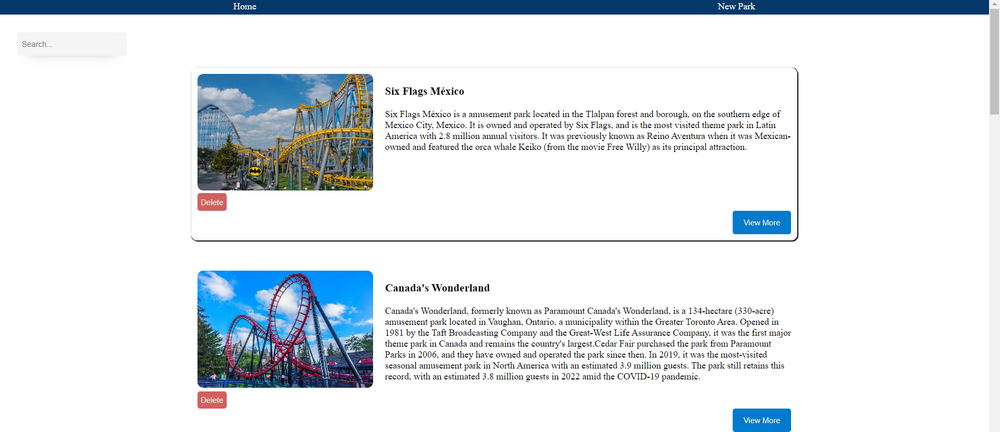

# Themepark-Frontend

## Date : 2/28/2024

### Made By:  
##  Fatima Fouad - Ali Albanna - AAmir Saleh

### **_Description_**
Theme Parks is a website where the user can view theme parks and their rides. with the option of deleting and updating rides and them parks.

---
### **Website Link:**
##### Live Link: [ThemeParks]()
---
### Screenshots:

## Website:
## Home Page 


### Technologies used

- [x] VSCode (Editor for Writing the Code)
- [x] HTML (Structure of the pages)
- [x] CSS (Style of the pages)
- [x] React JS (Frontend)
- [x] JavaScript (Functionality for the pages)
---
### What we have learned:

- [x] CSS.
- [x] React.
- [x] Connecting NodeJS with React JS..
---
### What we are most proud of is :
## Filtiring through the search:
```
.filter(
            (park) =>
              park.name.toLowerCase().includes(searchTerm) ||
              park.description.toLowerCase().includes(searchTerm)
          ) .....
```

---
### Future plans:

- [ ] Improve the design.
- [ ] Add more functionalities.


